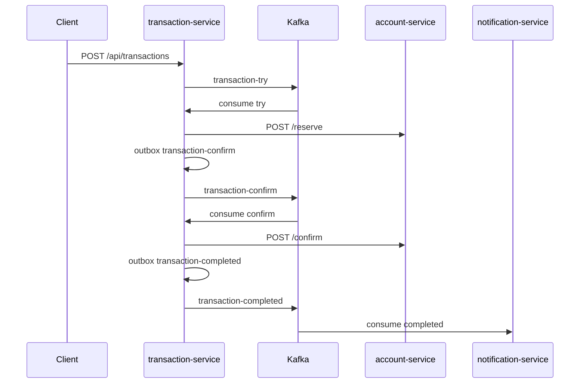

# Event-Driven Banking Platform

Микросервисная платформа переводов между счетами с saga-flow (`try → confirm → cancel`) на Kafka.

## Возможности

- Резервация, подтверждение и отмена баланса (`account-service`)
- Оркестрация перевода через Kafka (`transaction-service`)
- **Transactional Outbox** для надёжной публикации событий
- Уведомления о завершённых переводах (`notification-service`)
- API статуса перевода: `GET /api/transactions/{requestId}`
- Flyway-миграции, health endpoints, CI
- Unit + integration тесты (Testcontainers)

## Архитектура



## Стек

Kotlin 1.9, Spring Boot 3.2, Spring Kafka, JPA, PostgreSQL, Flyway, Docker Compose, JUnit 5, Mockito, MockK, Testcontainers

## Модули

| Модуль | Порт | Описание |
|--------|------|----------|
| `transaction-service` | 8081 | API переводов, saga, outbox |
| `account-service` | 8082 | Балансы, резервации, ledger |
| `notification-service` | 8083 | Kafka consumer уведомлений |
| `common-lib` | — | DTO, события, ошибки |

## Быстрый старт

```bash
docker compose up -d --build
```

### Пример перевода

```bash
curl -X POST http://localhost:8081/api/transactions \
  -H 'Content-Type: application/json' \
  -d '{"senderId":1,"receiverId":2,"amount":100.00}'
```

Проверка статуса (подставь `requestId` из ответа):

```bash
curl http://localhost:8081/api/transactions/{requestId}
```

Swagger:
- Transaction: http://localhost:8081/swagger-ui.html
- Account: http://localhost:8082/swagger-ui.html

## Локальная разработка

```bash
# инфраструктура
docker compose up -d postgres zookeeper kafka

# сервисы
./gradlew :account-service:bootRun
./gradlew :transaction-service:bootRun
./gradlew :notification-service:bootRun
```

## Тесты

```bash
./gradlew test
./gradlew build
```
